# Assignment 2 Report: StatefulSet Migration and Ingress

## 1. Introduction

This assignment focused on migrating the database from a Deployment-based setup to a Kubernetes StatefulSet and exposing the application through an NGINX Ingress controller.

The main objectives were to:

* Migrate the PostgreSQL database from a Deployment to a StatefulSet.
* Create persistent storage using a PersistentVolumeClaim.
* Verify that database data remains available after deleting and recreating the StatefulSet.
* Install and configure the NGINX Ingress controller.
* Create an Ingress resource for the frontend and backend services.
* Verify that the complete application works through the Ingress.
* Test backend API access through the Ingress.

---

# 2. Initial Application Setup

Before starting the migration, the application was running with a frontend, backend, and PostgreSQL database inside the Kubernetes cluster.

The initial application consisted of three main components:

* **Frontend** — provides the user interface.
* **Backend** — provides the REST API for managing tasks.
* **PostgreSQL database** — stores application data.

The application was tested before making any changes to ensure that the existing deployment was working correctly.

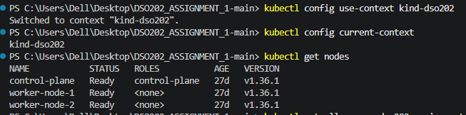


---

# 3. Creating a Test Task

A test task was created before the database migration. This task was used later to verify that the database data was preserved after migrating to a StatefulSet.


The created task provided a reference point for testing database persistence after the migration.

---

# 4. Database Migration to StatefulSet

## 4.1 Verify the Database Before Migration

Before migrating the database, the existing database Deployment and its persistent storage were checked.

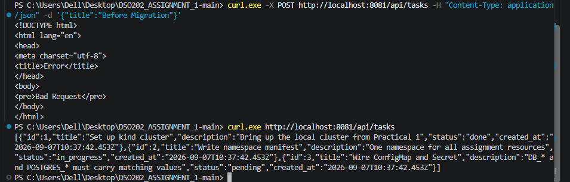

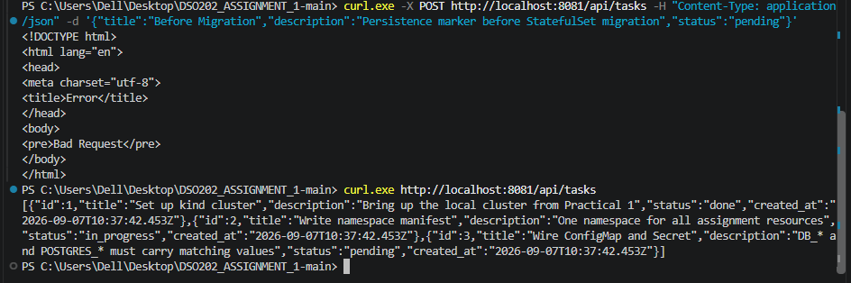

A marker task was also created to make it easier to confirm that the existing data was preserved after the migration.


---

## 4.2 Copy the Existing Manifests

The existing database manifests were copied so that they could be modified for the StatefulSet migration.


This allowed the original configuration to be retained while preparing the new StatefulSet configuration.

---

## 4.3 Delete the Old Database Deployment

The old PostgreSQL Deployment was deleted as part of the migration process.


The old Deployment was removed because the database would now be managed using a Kubernetes StatefulSet.

---

## 4.4 Delete the Old PVC

The old PersistentVolumeClaim was also removed before creating the new StatefulSet configuration.

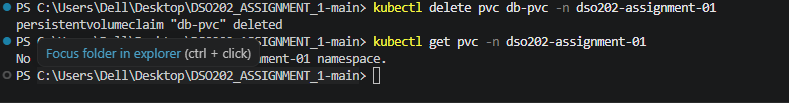

This prepared the environment for the StatefulSet to create its own persistent storage using a `volumeClaimTemplate`.

---

# 5. Creating the StatefulSet

A new `statefulset.yaml` file was created for the PostgreSQL database.


The StatefulSet provides stable database identity and persistent storage for the PostgreSQL instance. A PersistentVolumeClaim was created through the StatefulSet configuration.

---

## 5.1 Applying the StatefulSet

The new StatefulSet was applied to the Kubernetes cluster.

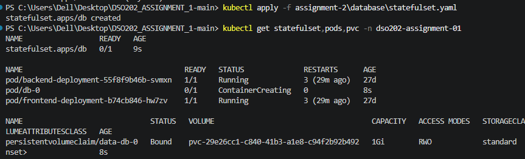


After applying the configuration, the PostgreSQL pod was successfully created and started.

A new persistent storage volume was also created for the database.

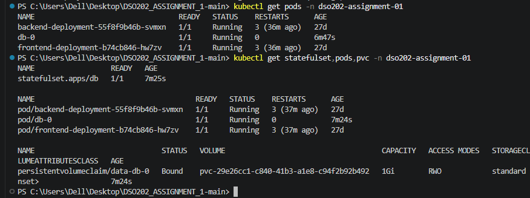

---

# 6. Verifying the Database Service

The PostgreSQL service was checked to ensure that the database remained accessible through the Kubernetes Service.


The database Service continued to provide network access to the PostgreSQL StatefulSet.

---

# 7. Verifying Backend Database Connection

The backend was then tested to confirm that it could successfully connect to the PostgreSQL database after the migration.

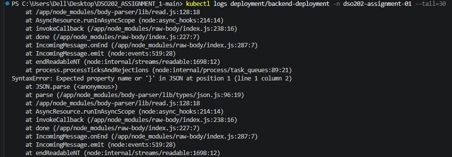

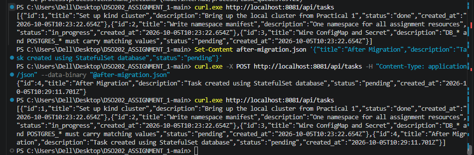

The successful response confirmed that the backend was able to communicate with the database after the migration.

---

# 8. Testing Database Persistence

Database persistence was tested by creating data and then deleting the StatefulSet.

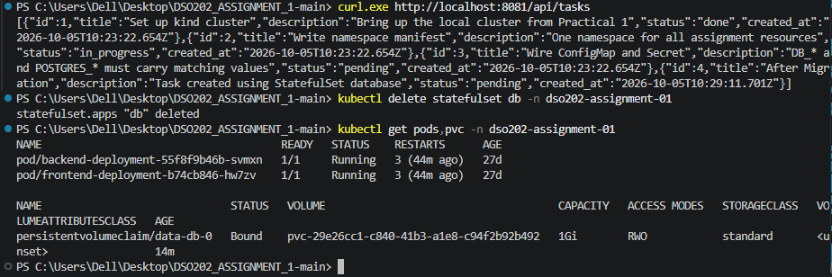

The StatefulSet was deleted, but the persistent storage remained available. This demonstrated the main benefit of using persistent storage with a StatefulSet: deleting the database pod does not automatically remove the stored database data.

---

## 8.1 Recreating the StatefulSet

The PostgreSQL StatefulSet was recreated after the persistence test.

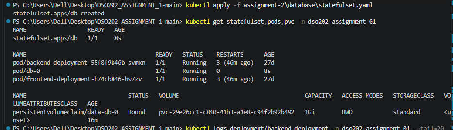


After recreation, the database was able to use the existing persistent storage.

This confirmed that the database data could survive the deletion and recreation of the StatefulSet.

---

# 9. Frontend Migration and Ingress

After completing the database migration, the next part of the assignment was to expose the application through an NGINX Ingress controller.

## 9.1 Installing the Ingress Controller

The NGINX Ingress controller was installed in the Kubernetes cluster.

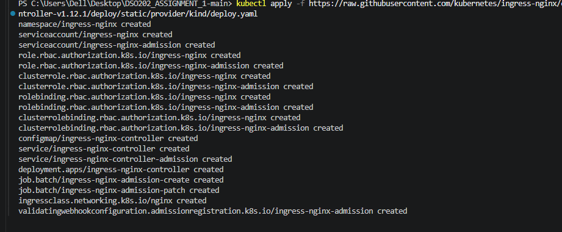

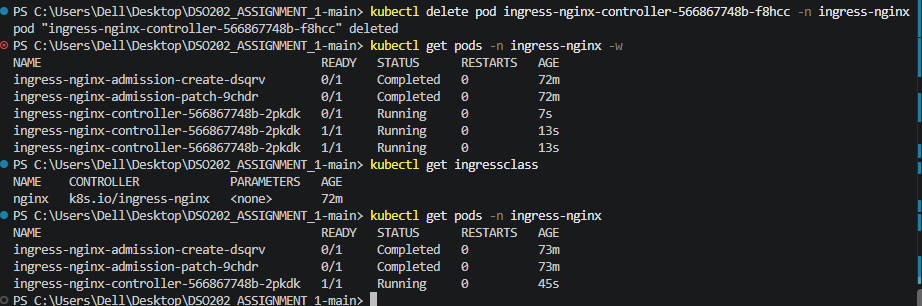

The Ingress controller was successfully deployed and became ready to process Ingress resources.

---

# 10. Creating the Ingress Resource

An Ingress resource was created for the application.

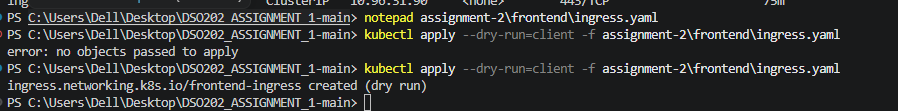

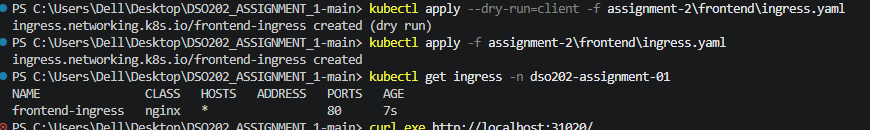

The Ingress was configured to route traffic to the appropriate Kubernetes Services.

The routing configuration used:

* `/` → `frontend-svc`
* `/api` → `backend-svc`

This allowed both the frontend application and backend API to be accessed through the same Ingress endpoint.

---

# 11. Accessing the Application Through Ingress

The Ingress controller was accessed using port forwarding.

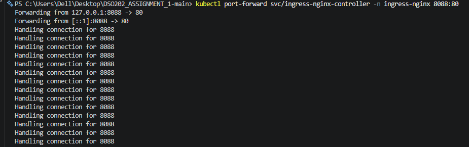

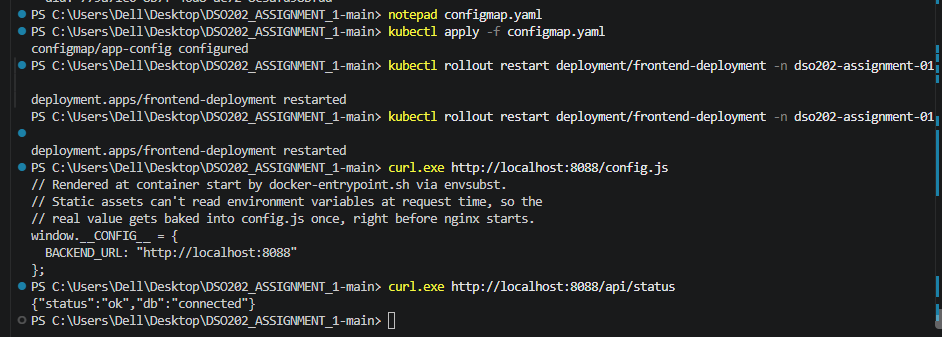

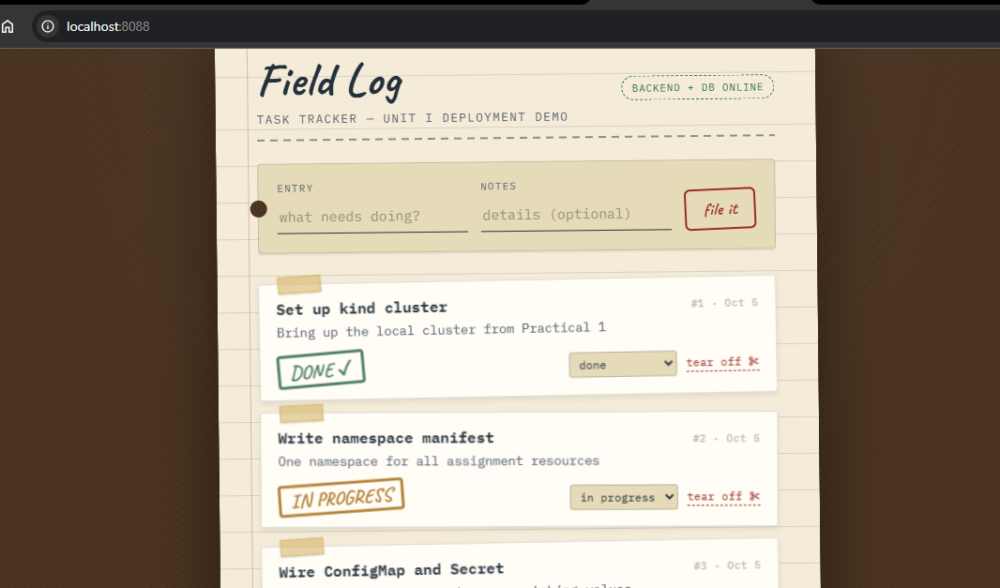

After port forwarding, the application could be accessed through the local Ingress endpoint.

---

# 12. Verifying the Complete Application

The complete application was tested after configuring the Ingress.

## 12.1 Verify Ingress

The Ingress resource was checked to confirm that it was correctly configured and associated with the NGINX Ingress controller.


The Ingress showed the expected frontend and backend routing configuration.


The frontend was successfully accessible through the Ingress, confirming that the Ingress controller was routing requests to the frontend service.

---

# 13. Verifying the StatefulSet and Persistent Volume

The database StatefulSet and persistent storage were checked after the migration.


The verification confirmed that:

* The PostgreSQL StatefulSet was running.
* The database pod was ready.
* The PersistentVolumeClaim was bound.
* Persistent storage was available for the database.

This confirmed that the database migration was successfully completed.

---

# 14. Testing the Backend Through Ingress

The backend API was tested through the Ingress rather than accessing the backend service directly.


The successful API response confirmed that the `/api` path was correctly routed from the Ingress controller to `backend-svc`.

Therefore, the final routing structure was:

```text
Browser
   │
   ▼
NGINX Ingress
   │
   ├── / ──────► frontend-svc
   │
   └── /api ───► backend-svc
                    │
                    ▼
                 db-svc
                    │
                    ▼
              PostgreSQL
              StatefulSet
                    │
                    ▼
              PersistentVolume
```

---

# 15. Conclusion

Assignment 2 successfully migrated the PostgreSQL database from a Deployment-based configuration to a StatefulSet with persistent storage. The StatefulSet created a persistent volume for the database, and the persistence test confirmed that the database storage remained available after deleting and recreating the StatefulSet.

The NGINX Ingress controller was also successfully installed and configured. An Ingress resource was created to route frontend requests to `frontend-svc` and API requests under `/api` to `backend-svc`.

Finally, the complete application was tested through the Ingress, including the backend API. The successful tests confirmed that the frontend, backend, database, StatefulSet, persistent storage, and Ingress were working together correctly.
