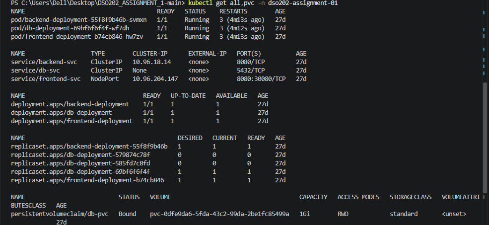
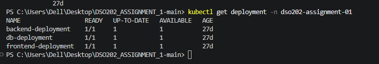

task created
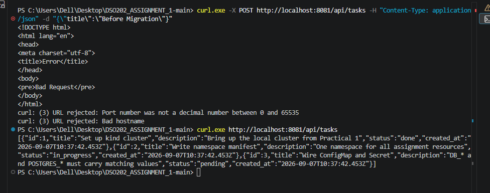
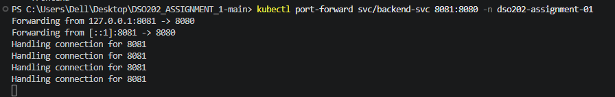
before migration

marker task was created
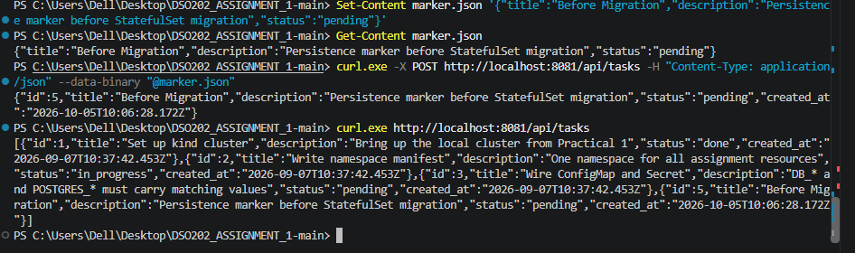

Copy the old manifests

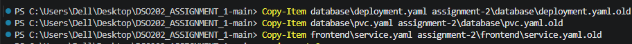

Delete the old DB Deployment
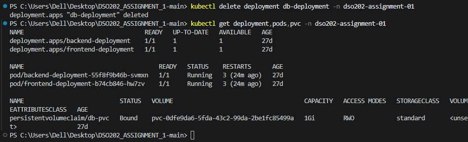

Delete the old PVC

Create statefulset.yaml
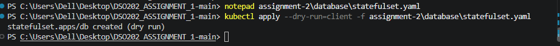

Apply the StatefulSet

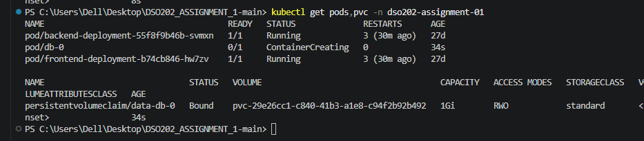

new persistent storage was successfully created.

Verify the database Service
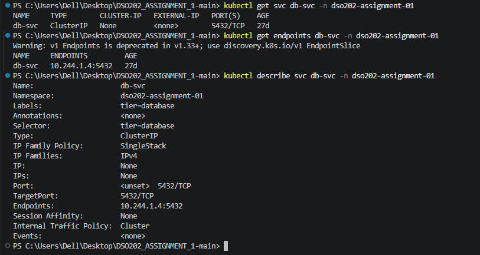

Verify the backend connection

Now test persistence
 StatefulSet deleted, but persistent storage remains.

Recreate the StatefulSet

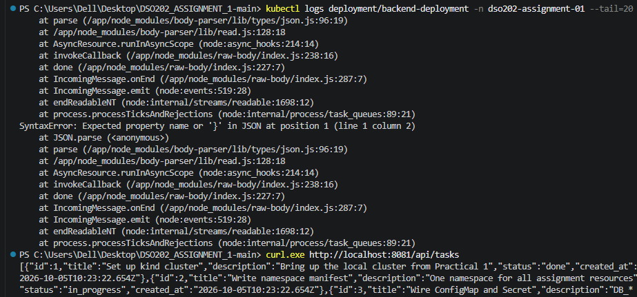

Frontend migration
Install the Ingress controller

create the Ingress

Port-forward the Ingress controller

Verify the complete application
verify ingress
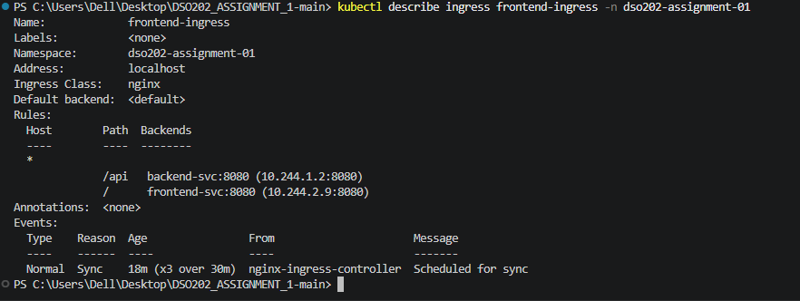

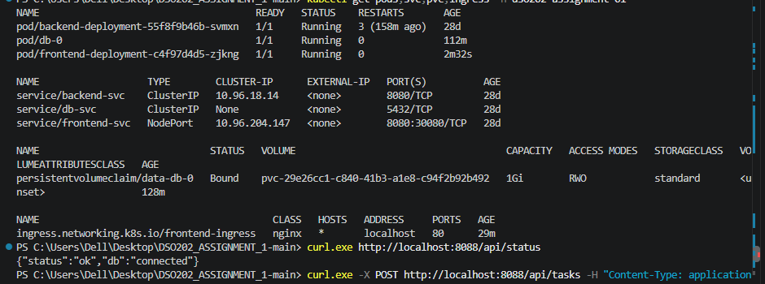

5. Verify the StatefulSet/PersistentVolume

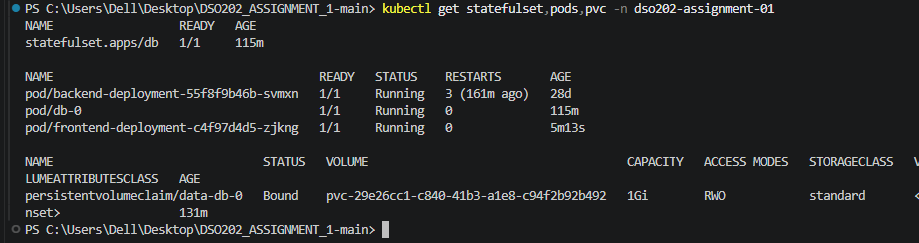

2. Test backend through Ingress
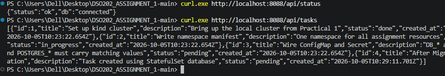